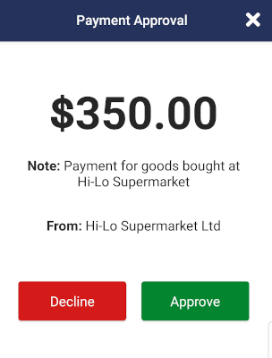

# 02 - Customer Payment Approval

The customer will scan the QR Code shown by the merchant which will bring them to the "**Payment Approval**" screen where they can click either the **Approve** or **Decline** payment button.

On clicking the Approve button the following API URL would be executed: customer/request_payments/approve/{id}

Once approval is final the funds will be transferred from the customer to the merchant. If there are any issues an error will be returned to the customer stating the error.

On clicking the Decline button the following API URL would be executed: customer/request_payments/decline/{id}

Once the decline button is clicked the Payment Request and connected Invoice are set to "**Cancelled**".